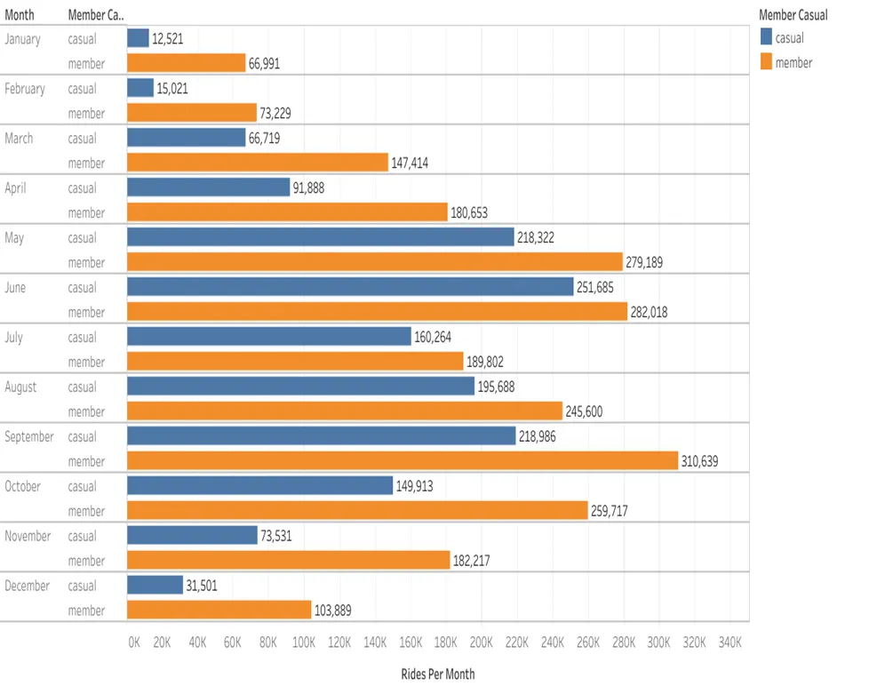
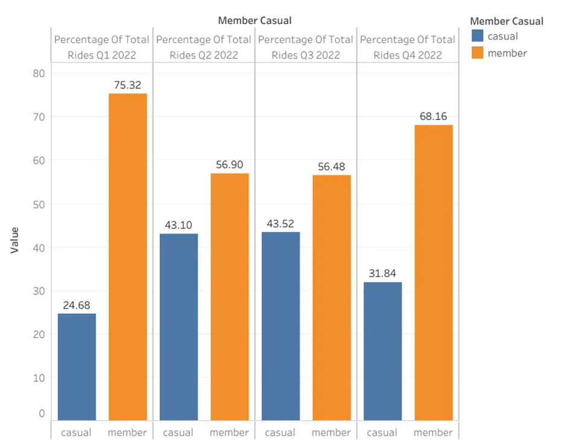
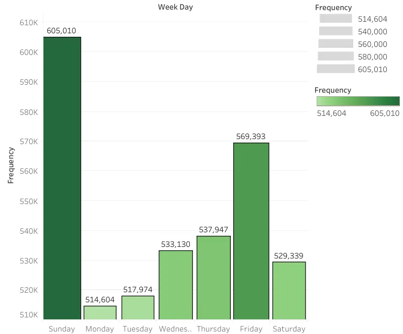
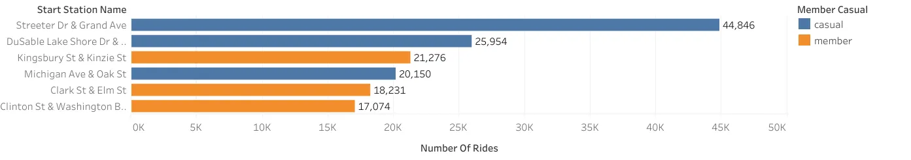

# 🚲 Cyclistic Bike-Share Analysis
### Google Data Analytics Professional Certificate — Capstone Project

    

📖 **Full case study write-up:** [Read on Medium](https://medium.com/@krupalpatel3972/cyclistic-case-study-9c5a110290c0)

---

## 📋 Business Task

Cyclistic is a bike-sharing company in Chicago. The director of marketing believes the company's future success depends on maximizing annual memberships.

**Goal:** Analyze how casual riders and annual members use Cyclistic bikes differently, and provide data-driven recommendations to convert casual riders into annual members.

---

## 👥 Key Stakeholders

| Stakeholder | Role |
|---|---|
| Lily Moreno | Director of Marketing |
| Cyclistic Marketing Analytics Team | Data collection, analysis, reporting |
| Cyclistic Executive Team | Final approval of recommended marketing program |

---

## 🗂️ Data Source

- **Dataset:** Cyclistic historical trip data — full year 2022 (12 months)
- **Source:** [Divvy Trip Data](https://divvy-tripdata.s3.amazonaws.com/index.html) — provided by Motivate International Inc.
- **License:** [Data License Agreement](https://divvybikes.com/data-license-agreement)
- **Format:** 12 monthly CSV files merged into quarterly and annual tables using BigQuery

---

## 🛠️ Tools Used

| Tool | Purpose |
|---|---|
| Microsoft Excel | Data cleaning, new column creation |
| Google BigQuery (SQL) | Merging monthly files, aggregation, analysis |
| Google Cloud Console | File upload and cloud storage |
| Google Looker Studio | Data visualization and charting |

---

## 🧹 Data Cleaning (Excel)

Steps performed on each monthly CSV file before uploading to BigQuery:

- Removed duplicate records
- Filtered and deleted rows with **null values**
- Removed trip IDs containing special characters
- Removed rows where station ID and station name were missing
- Deleted trips where **end time ≤ start time** (invalid records)
- Created new column **`week_day`**:
  ```
  =CHOOSE(WEEKDAY(C2),"Sunday","Monday","Tuesday","Wednesday","Thursday","Friday","Saturday")
  ```
- Created new column **`travel_time`**:
  ```
  =D2-C2
  ```

---

## 🔍 Analysis (SQL — Google BigQuery)

All SQL queries are in [`analysis.sql`](analysis.sql)

**Analyses performed:**
- Monthly and quarterly ride totals by member type
- Percentage share of rides by member type (annual and per quarter)
- Weekday ride frequency by rider type
- Top 3 start and end stations by rider type
- Bike type usage per quarter and percentage of total
- Average and maximum ride length by rider type

---

## 📊 Results & Visualizations

### 1. Rides Per Month

| Month | Casual | Member |
|---|---|---|
| January | 12,521 | 66,991 |
| February | 15,021 | 73,229 |
| March | 66,719 | 147,414 |
| April | 91,888 | 180,653 |
| May | 218,322 | 279,189 |
| June | 251,685 | 282,018 |
| July | 160,264 | 189,802 |
| August | 195,688 | 245,600 |
| September | 218,986 | 310,639 |
| October | 149,913 | 259,717 |
| November | 73,531 | 182,217 |
| December | 31,501 | 103,889 |



---

### 2. Rides Per Quarter

| Quarter | Total Trips |
|---|---|
| Q1 (Jan–Mar) | 381,895 |
| Q2 (Apr–Jun) | 1,303,755 |
| Q3 (Jul–Sep) | 1,320,979 |
| Q4 (Oct–Dec) | 800,768 |

---

### 3. Percentage of Total Rides by Member Type

**Full Year 2022:**

| Rider Type | % of Total Rides |
|---|---|
| Member | 60.97% |
| Casual | 39.03% |

**By Quarter:**

| Quarter | Casual % | Member % |
|---|---|---|
| Q1 | 24.68% | 75.32% |
| Q2 | 43.10% | 56.90% |
| Q3 | 43.52% | 56.48% |
| Q4 | 31.84% | 68.16% |



> **Insight:** Casual rider share nearly doubles from Q1 (24.68%) to Q2/Q3 (~43%), indicating strong seasonal behaviour. Members ride consistently year-round.

---

### 4. Rides During Weekdays

**Casual Riders (ranked by frequency):**

| Rank | Day | Rides |
|---|---|---|
| 1 | Sunday | 287,370 |
| 2 | Monday | 237,319 |
| 3 | Saturday | 208,734 |
| 4 | Friday | 204,578 |
| 5 | Tuesday | 188,139 |
| 6 | Thursday | 182,866 |
| 7 | Wednesday | 177,033 |

**Annual Members (ranked by frequency):**

| Rank | Day | Rides |
|---|---|---|
| 1 | Friday | 364,815 |
| 2 | Wednesday | 356,097 |
| 3 | Thursday | 355,081 |
| 4 | Tuesday | 329,835 |
| 5 | Saturday | 320,605 |
| 6 | Sunday | 317,640 |
| 7 | Monday | 277,285 |



> **Insight:** Casual riders peak on **Sunday** (287,370 rides) — leisure use. Members peak on **Friday** (364,815 rides) and are highest mid-week — commuting pattern.

**Maximum single-day frequency across all riders: Sunday — 605,010 rides**

---

### 5. Top 3 Stations by Rider Type

**End Stations:**

| Rider Type | Rank | Station |
|---|---|---|
| Casual | 1 | Streeter Dr & Grand Ave |
| Casual | 2 | Michigan Ave & Oak St |
| Casual | 3 | DuSable Lake Shore Dr & Monroe St |
| Member | 1 | Kingsbury St & Kinzie St |
| Member | 2 | Clark St & Elm St |
| Member | 3 | Wells St & Concord Ln |

**Start Stations (with ride counts):**

| Rider Type | Rank | Station | Rides |
|---|---|---|---|
| Casual | 1 | Streeter Dr & Grand Ave | 44,846 |
| Casual | 2 | DuSable Lake Shore Dr & Monroe St | 25,954 |
| Casual | 3 | Michigan Ave & Oak St | 20,150 |
| Member | 1 | Kingsbury St & Kinzie St | 21,276 |
| Member | 2 | Clark St & Elm St | 18,231 |
| Member | 3 | Clinton St & Washington Blvd | 17,074 |



> **Insight:** Casual rider stations cluster near tourist destinations (lakefront, Millennium Park, Magnificent Mile). Member stations are in residential/commercial neighbourhoods — consistent with commuting.

---

### 6. Bike Type Usage Per Quarter

| Bike Type | Rider Type | Q1 | Q2 | Q3 | Q4 |
|---|---|---|---|---|---|
| classic_bike | member | 196,147 | 518,412 | 480,512 | 322,722 |
| classic_bike | casual | 49,919 | 317,830 | 275,896 | 106,441 |
| electric_bike | member | 91,487 | 223,448 | 265,529 | 223,101 |
| electric_bike | casual | 33,875 | 179,895 | 244,102 | 128,521 |
| docked_bike | casual only | 10,467 | 64,170 | 54,940 | 19,983 |

**Percentage of Total Rides by Bike Type (Full Year):**

| Bike Type | % of Total Rides |
|---|---|
| Classic Bike | 59.57% |
| Electric Bike | 36.51% |
| Docked Bike | 3.93% |

> **Insight:** Classic bikes dominate at 59.57%. **Docked bikes were used exclusively by casual riders** — members never used them across any quarter.

---

### 7. Average & Maximum Ride Length

| Rider Type | Average Ride Length |
|---|---|
| Casual | 23 min 58 sec |
| Member | 12 min 26 sec |

**Maximum ride length recorded: 23 hours 58 min 35 sec**

> **Insight:** Casual riders average nearly **twice the ride duration** of members, reinforcing the leisure vs. commute distinction.

---

## 💡 Key Findings Summary

| # | Finding |
|---|---|
| 1 | Members accounted for **60.97%** of total rides; casual riders **39.03%** |
| 2 | Casual rider share surges to **~43% in Q2 and Q3** — strong seasonal effect |
| 3 | Casual riders peak on **Sundays** (leisure); members peak on **Fridays** (commute) |
| 4 | Casual stations are near **tourist areas**; member stations near **residential/commercial** zones |
| 5 | **Docked bikes exclusively used by casual riders** across all four quarters |
| 6 | Casual riders' average trip is **nearly twice as long** (24 min vs 12 min) |

---

## 🎯 Top 3 Recommendations

**1. Summer Conversion Campaign**
Target casual riders in Q2 and Q3 with promotions highlighting annual membership cost savings. The 43% casual share in summer is the highest conversion window of the year.

**2. Location-Based Marketing**
Place membership campaigns physically at Streeter Dr & Grand Ave (44,846 casual starts), DuSable Lake Shore Dr & Monroe St (25,954), and Michigan Ave & Oak St (20,150) — the three highest-volume casual rider stations.

**3. Weekend Incentive Program**
Launch weekend-specific trial memberships or discounts. Sunday drives 605,010 total rides and is casual riders' busiest day (287,370 rides) — the single highest-impact moment to promote conversion.

---

## 🔬 Areas for Further Research

- **Demographics:** Age, gender, and occupation data for better customer segmentation and targeted campaigns
- **External factors:** Weather, holidays, and events as predictors of bike demand and availability planning
- **Customer feedback:** Surveys to identify the specific barriers preventing casual riders from converting to annual memberships

---

## 📁 Repository Structure

```
cyclistic-bike-share-analysis/
│
├── README.md                        ← Project overview with full results (you are here)
├── analysis.sql                     ← All 13 BigQuery SQL queries with comments
└── visualizations/
    ├── rides_per_month.png          ← Monthly rides bar chart (casual vs member)
    ├── quarterly_percentage.png     ← % of rides per quarter by rider type
    ├── weekday_frequency.png        ← Ride frequency by weekday (all riders)
    ├── top_stations.png             ← Top start stations by rider type
    └── bike_type_usage.png          ← Bike type breakdown per quarter
```

---

## 👤 About

**Krupal Patel** — IT Graduate | Financial Data Analyst | Python · SQL · Power BI  
📍 Waterloo, Ontario, Canada  
🔗 [LinkedIn](https://www.linkedin.com/in/krupal-patel-099462207) | 📖 [Medium](https://medium.com/@krupalpatel3972)
